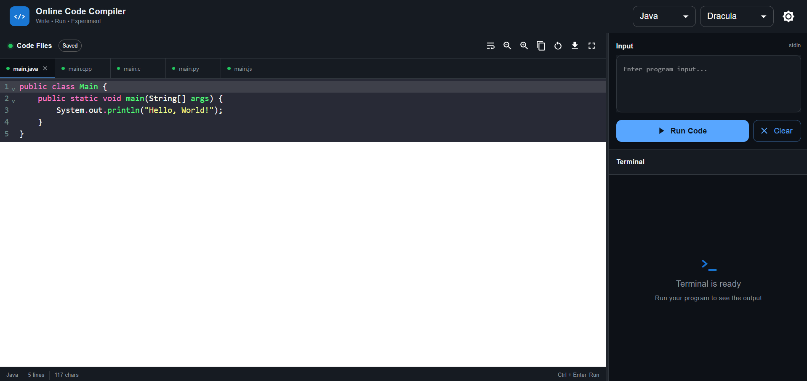
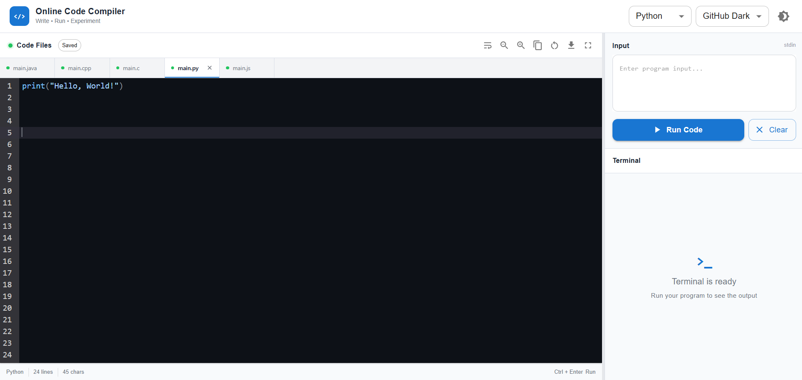

# 💻 Online Code Compiler

A modern, web-based online code compiler that allows users to write, execute, and experiment with programs in multiple programming languages directly from the browser.

Built with **React, Node.js, Express, CodeMirror, Material UI, and Judge0 CE**.

🌐 **Live Demo:** https://online-code-compiler-kappa.vercel.app/

📦 **GitHub Repository:** https://github.com/sankky07/Online-Code-Compiler

---

## 🚀 Features

### 🧑‍💻 Multi-Language Code Editor

Write and execute code in:

- ☕ Java
- ⚡ C++
- 🔵 C
- 🐍 Python
- 🟨 JavaScript

Each language has its own editor tab and starter code.

### ⚙️ Code Execution

Programs are executed through the **Judge0 CE API**.

The compiler supports:

- Standard input
- Standard output
- Runtime errors
- Compilation errors
- Execution time
- Memory usage
- Execution status

### 🎨 Modern Code Editor

Powered by **CodeMirror** with:

- Syntax highlighting
- Line numbers
- Code folding
- Bracket matching
- Auto-closing brackets
- Autocompletion
- Multiple selections
- Selection highlighting
- Word wrapping
- Adjustable font size

### 🌗 Dark & Light Mode

Switch between dark and light modes. The selected preference is stored locally.

### 🎭 Editor Themes

Available editor themes:

- GitHub Dark
- Dracula
- Eclipse

### 💾 Local Autosave

Your code, input, language, theme, and editor preferences are automatically saved in the browser using `localStorage`.

Refreshing the page does not remove your work.

### 📑 Multiple Language Tabs

Switch between programming languages without losing the code written in each editor.

### 🖥️ Integrated Terminal

The terminal displays:

- `STDOUT`
- `STDERR`
- Compilation errors
- Execution status
- Execution time
- Memory usage

### 📐 Resizable Layout

Resize the editor and terminal panels according to your preference.

### ⛶ Fullscreen Mode

Use fullscreen mode for a distraction-free coding experience.

Shortcut:

```text
F11
```

### ⌨️ Keyboard Shortcuts

| Shortcut | Action |
|----------|--------|
| `Ctrl + Enter` | Run Code |
| `Ctrl + S` | Prevent browser save dialog |
| `F11` | Toggle Fullscreen |

### 📋 Developer Utilities

- Copy code
- Copy output
- Download source code
- Reset code
- Clear terminal
- Font size controls
- Word wrap

### 📱 Responsive UI

The interface adapts to smaller screens and reorganizes the editor and terminal for mobile devices.

---

## 🏗️ Architecture

```text
┌───────────────────────────────┐
│           Browser             │
│                               │
│        React Frontend         │
│        CodeMirror Editor      │
└───────────────┬───────────────┘
                │
                │ HTTP POST
                ▼
┌───────────────────────────────┐
│       Node.js + Express       │
│                               │
│        /execute API           │
└───────────────┬───────────────┘
                │
                │ HTTP Request
                ▼
┌───────────────────────────────┐
│          Judge0 CE            │
│                               │
│   Compile & Execute Program   │
└───────────────┬───────────────┘
                │
                │ Execution Result
                ▼
┌───────────────────────────────┐
│        Express Backend        │
└───────────────┬───────────────┘
                │
                │ JSON Response
                ▼
┌───────────────────────────────┐
│        React Frontend         │
│                               │
│       Terminal Output         │
└───────────────────────────────┘
```

---

## 🛠️ Tech Stack

### Frontend

- React
- JavaScript
- Material UI
- CodeMirror
- Axios
- CSS

### Backend

- Node.js
- Express.js
- Axios
- CORS

### Code Execution

- Judge0 CE

### Deployment

- Vercel — Frontend
- Render — Backend

### Storage

- Browser `localStorage`

---

## 📁 Project Structure

```text
Online-Code-Compiler/
│
├── backend/
│   ├── server.js
│   ├── package.json
│   └── package-lock.json
│
├── frontend/
│   ├── public/
│   │
│   ├── src/
│   │   ├── components/
│   │   │   ├── Editor.js
│   │   │   └── Editor.css
│   │   │
│   │   ├── App.js
│   │   ├── App.css
│   │   ├── index.js
│   │   └── index.css
│   │
│   ├── package.json
│   └── package-lock.json
│
├── .gitignore
└── README.md
```

---

## ⚡ Getting Started

### 1. Clone the repository

```bash
git clone https://github.com/sankky07/Online-Code-Compiler.git
cd Online-Code-Compiler
```

### 2. Frontend Setup

```bash
cd frontend
npm install
npm start
```

Frontend:

```text
http://localhost:3000
```

### 3. Backend Setup

Open another terminal:

```bash
cd backend
npm install
node server.js
```

Backend:

```text
http://localhost:5000
```

---

## 🔌 API

### Execute Code

```http
POST /execute
```

Request:

```json
{
  "language": "Python",
  "code": "print('Hello World')",
  "input": ""
}
```

Response:

```json
{
  "status": "Accepted",
  "output": "Hello World\n",
  "error": "",
  "compileOutput": "",
  "executionTime": "0.01",
  "memoryUsage": 12000,
  "exitCode": 0
}
```

---

## 🧠 Language Mapping

| Language | Judge0 ID |
|----------|-----------|
| C | 50 |
| C++ | 54 |
| Java | 62 |
| JavaScript | 63 |
| Python | 71 |

---

## 🌐 Deployment

### Frontend

Deployed using **Vercel**.

Live application:

https://online-code-compiler-kappa.vercel.app/

### Backend

Deployed using **Render**.

Backend:

https://online-code-compiler-ljop.onrender.com

Health check:

```text
GET /health
```

---

## 🔐 Environment Configuration

The backend supports configuring the Judge0 endpoint using an environment variable:

```env
JUDGE0_URL=https://ce.judge0.com
```

For local development, environment variables can be stored in:

```text
backend/.env
```

> Never commit real API keys or secrets to GitHub.

---

```markdown
## 📸 Screenshots

```markdown
## 📸 Screenshots

### 🌙 Dark Mode



### ☀️ Light Mode



---

## 🎯 Project Goals

The project was built to provide a simple and accessible coding environment that works directly in the browser without requiring users to install a compiler locally.

Main goals:

- Build a practical full-stack application
- Integrate a real code execution service
- Create a responsive developer-oriented interface
- Handle compilation and runtime errors
- Implement persistent client-side state
- Deploy a complete application publicly

---

## 💡 What I Learned

Building this project provided hands-on experience with:

- React component architecture
- React Hooks
- State management
- CodeMirror integration
- REST API development
- Express.js
- Axios
- API integration
- Asynchronous programming
- Error handling
- Local storage
- Responsive UI design
- Full-stack deployment
- Vercel deployment
- Render deployment
- Git and GitHub workflows

---

## 🚧 Limitations

The current version depends on an external Judge0 execution service.

Therefore:

- Execution availability depends on the Judge0 service.
- Execution speed can vary.
- The public deployment is intended primarily for demonstration and learning.
- The application currently supports a limited set of programming languages.

---

## 🔮 Future Improvements

Possible future enhancements include:

- User authentication
- Cloud-based code storage
- Shareable code links
- More programming languages
- Custom compiler configurations
- Collaborative coding
- AI-powered code explanations
- AI debugging assistance
- GitHub integration
- Project/file management
- Custom test cases

---

## 🤝 Contributing

Contributions are welcome.

```bash
git clone https://github.com/sankky07/Online-Code-Compiler.git
cd Online-Code-Compiler
git checkout -b feature/your-feature
```

Make your changes:

```bash
git add .
git commit -m "Add your feature"
git push origin feature/your-feature
```

Then create a Pull Request.

---

## 📄 License

This project is available for educational and personal use.

---

## 👨‍💻 Author

**Sanket Sahu**

Full-Stack Developer | Java | JavaScript | React | Node.js | Python | AI

GitHub:

https://github.com/sankky07

---

⭐ If you found this project useful, consider giving the repository a star!
